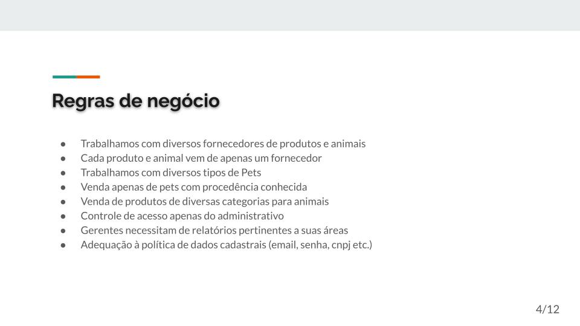

# TRABALHO FINAL P2 - Banco de Dados 

**Gustavo Barbieri Esposar**  
Email: [ra00297810@pucsp.edu.br](mailto:ra00297810@pucsp.edu.br)

---

<!-- TOC -->

- [TRABALHO FINAL P2 - Banco de Dados (Profª Sandra Bozolan)](#trabalho-final-p2---banco-de-dados-profª-sandra-bozolan)
    - [INSTRUÇÕES SOBRE A APLICAÇÃO](#instruções-sobre-a-aplicação)
    - [Apresentação](#apresentação)
        - [Tema do Projeto](#tema-do-projeto)
        - [Tecnologias](#tecnologias)
        - [Análise de Domínio](#análise-de-domínio)
        - [Regras de Negócio](#regras-de-negócio)
        - [Requisitos da Aplicação](#requisitos-da-aplicação)
        - [Modelo Entidade Relacionamemto](#modelo-entidade-relacionamemto)
        - [Arquitetura MVC](#arquitetura-mvc)

<!-- /TOC -->

---

## INSTRUÇÕES SOBRE A APLICAÇÃO

**OBS.: Necessário Maven para baixar as dependências contidas no `pom.xml`.**

1. **Carregue o Dump desejado no seu MySQL**
    - Escolha entre o Dump sem registros (estrutura) ou o Dump com registros (completo).

2. **Altere os dados para acessar o Banco conforme necessário**
    - **OBS.:** Usuário "root" e senha "150909" por padrão.
    - Fully qualified name da classe que possui os dados de conexão:
        - `src.main.java.dev.gustavoesposar.database.DatabaseManager.java`
    - Altere as constantes `URL` para a correspondente a sua porta de conexão.
    - Altere o usuário e a senha conforme suas necessidades.

3. **Ambos os Dumps possuem um registro padrão na tabela Login para acessar o Sistema**
    - **Email:** admin
    - **Senha:** senha123

4. **Execute a aplicação através da classe:**
    - `src.main.java.dev.gustavoesposar.App.java`

Pronto, agora é só testar! ╰(*°▽°*)╯  ㄟ(≧◇≦)ㄏ

## Apresentação

### Tema do Projeto

### Tecnologias

### Análise de Domínio

### Regras de Negócio

### Requisitos da Aplicação

### Modelo Entidade Relacionamemto

### Arquitetura MVC

